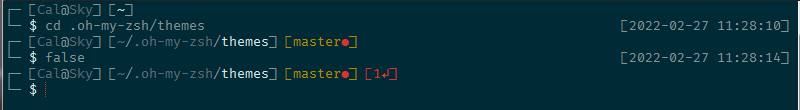

# boxy-zsh-theme
Custom multiline oh-my-zsh theme

With [Solarized dark scheme](http://ethanschoonover.com/solarized) from [mintty-colors-solarized](https://github.com/mavnn/mintty-colors-solarized)

* Username and host name
* Current directory with syntax coloring
* `git` status
* Return status of last command
* Time the last command was started

Requires [FiraCode](https://github.com/tonsky/FiraCode) font. Alternate version that does not need FiraCode also provided.
