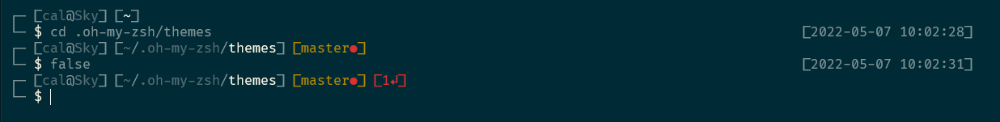
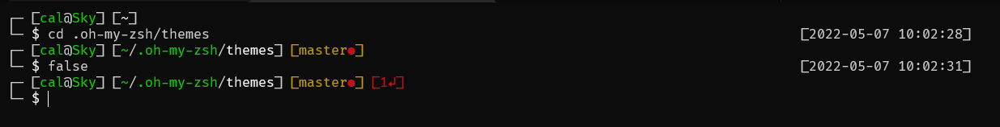

# boxy-zsh-theme
Custom multiline oh-my-zsh theme.

## Solarized Dark Theme

## Campbell Theme

## Features
* Username and host name
* Current directory with syntax coloring
* `git` status
    * uses `git-prompt` plugin status if it is installed
* Return status of last command
* Time the last command was started

Requires [FiraCode](https://github.com/tonsky/FiraCode) font. Alternate version that does not need FiraCode also provided.
